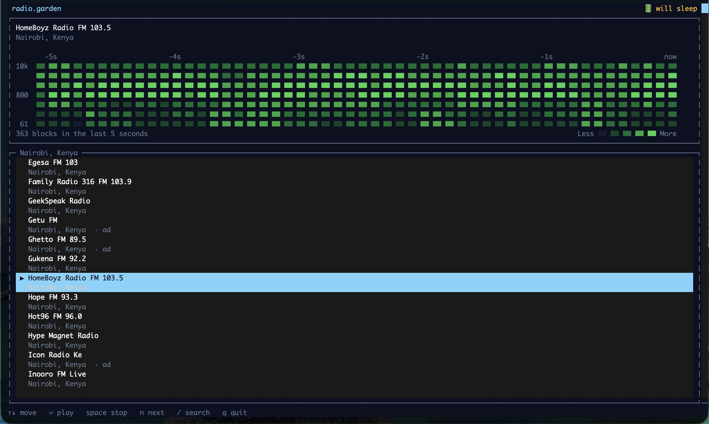

A terminal client for [radio.garden](https://radio.garden/): browse stations by
place, play one, and watch the audio scroll past as a GitHub contribution graph.
Playback runs in a background daemon, so it survives closing the terminal — and a
closed lid, when you're on mains power.

> Inspired by [radio.garden](https://radio.garden/) and built on its API, which
> is undocumented and unofficial. This project is not affiliated with or endorsed
> by Radio Garden, and the API may change or disappear without notice.



Seven log-spaced frequency rows, 40 Hz to 16 kHz, a new column every 100 ms — a
spectrogram in GitHub's five shades of green. The squares are real FFT output,
not decoration: a bass-heavy track fills the bottom rows, a cymbal lights the top
one, and silence empties the grid. The capture above is live output, not a
mockup — HomeBoyz Radio FM 103.5 out of Nairobi, five seconds of it.

The grid does not advance a column at a time. A square is three characters wide,
so the strip slides one character every 33 ms and the leading square is clipped
mid-glyph as it leaves: the motion runs at the render tick, 30 steps a second,
rather than hopping a whole cell ten times a second.

## The other visualiser

Press `s` and the grid gives way to a 1/3-octave analyser: 31 bars on the ISO 266
preferred centres, 20 Hz to 20 kHz, each band a fixed hue running red at the
bottom of the spectrum to violet at the top, with a peak marker over each bar
that holds for 700 ms and then falls. The frequency ruler underneath is an octave
ruler — three third-octave bands to the octave, so labelling every third one
lands exactly on 20, 40, 80, 160, 315, 630, 1.25k, 2.5k, 5k, 10k, 20k.

31 is not a round number someone picked. Third-octave spacing across the audible
range *is* 31 bands, and choosing any other count would mean choosing a different
bandwidth. The two ends of that range are honest about what the streams carry: at
128 kbps most stations are lowpassed near 16 kHz, so the 20 kHz bar usually sits
on its floor tick, and the 20-31.5 Hz bars only move on genuinely bass-heavy
material. A dark bar is a true reading, not a broken one.

Bands are scored by summed power across the band rather than by the loudest bin
in it, which is what a hardware analyser integrates and what makes pink noise —
which broadcast music approximates — draw as a flat line. It also means the
display needs no spectral tilt: `probe/thirds-probe.ts` asserts both halves,
pink flat and white noise rising 3 dB per octave.

Both visualisers are computed for every frame whether or not you are looking at
them, so `s` cuts straight to a live display rather than one that has to fill.

## Requirements

- **Bun** (tested on 1.3.9)
- **macOS** — power handling and audio output are macOS-specific
- **ffmpeg** *(optional)* — only for AAC stations, ~39% of the catalogue. Without
  it, MP3 stations play and AAC ones report a clear error. `brew install ffmpeg`

## Run

```bash
bun install
bun start           # launch the player
bun run kill        # stop background playback
```

## Keys

| Key | Action |
|---|---|
| `↑` `↓` | move through the station list |
| `⏎` | play the selected station |
| `space` | stop |
| `n` | next station in the current place |
| `s` | switch visualiser — contribution grid ⇄ 1/3-octave bars |
| `/` | search stations and places |
| `q` | quit the client — **playback keeps going** |

`q` leaves the daemon running by design; `bun run kill` stops the music. The
daemon also exits on its own after five idle minutes.

## The lid badge

`⚡︎ lid-safe` / `🔋 will sleep` reports what actually happens if you shut the lid.
On mains power a `caffeinate -s` assertion is held while playing and audio
survives lid-close. On battery it does not — `-s` is "valid only when system is
running on AC power" (`man caffeinate`), and lid-close sleep is handled below
userspace. The assertion is held only while something plays, so an idle daemon
never keeps the machine awake.

## How it works

```
Radio Garden API ──resolve 302──> upstream URL ──> codec?
                                       ┌───────────┴───────────┐
                                  audio/mpeg               audio/aac*
                                       │                       │
                              playStreamUrl()          ffmpeg → mp3 → playStream()
                                       └───────────┬───────────┘
                                        OpenTUI audio engine → speakers
                                                   │
                                              output tap
                                       ┌───────────┴───────────┐
                                  2048 window             8192 window
                                       │                       │
                            7 contribution levels     31 third-octave bars
                                       └───────────┬───────────┘
                                       both in every frame → clients
```

Playback, buffering, reconnect and ICY metadata come from
[OpenTUI](https://github.com/anomalyco/opentui)'s native audio engine, which
accepts MP3 and FLAC only — hence the ffmpeg transcode for AAC. Both paths
converge on the same output tap, which is what the spectrum reads, so the grid
tracks the audio you hear rather than a decode running ahead of it.

Design rationale, the API's undocumented behaviour, and the measurements behind
these choices are in [`doc/INTENT.md`](doc/INTENT.md).

## Layout

```
src/
  shared/protocol.ts   message types, socket paths, FrameWriter
  api/client.ts        Radio Garden API, places cache, codec routing
  daemon/
    main.ts            socket server, lifecycle, auto-skip
    player.ts          playback, codec routing, watchdogs
    spectrum.ts        FFT and per-band contribution levels
    thirds.ts          1/3-octave band power and bar heights
    power.ts           pmset polling and the caffeinate assertion
  client/
    tui.ts             wiring: connection, keys, bootstrap
    graph.ts           scrolling column history behind the contribution grid
    bars.ts            bar heights, peak hold, and the rainbow palette
    view.ts            pure rendering
probe/                 runnable checks against the live API and real audio
```

## Probes

```bash
bun probe/fft-probe.ts       # tones land in the right bands; music scatters across levels
bun probe/thirds-probe.ts    # every ISO centre owns its band; pink reads flat, white rises
bun probe/view-probe.ts      # headless render assertions, both visualisers
bun probe/api-probe.ts       # live API: search, places, codec routing
bun probe/daemon-probe.ts    # daemon end to end, spectrum frames flowing
bun probe/audio-probe.ts     # OpenTUI native playback + ICY metadata
bun probe/aac-shim-probe.ts  # ffmpeg AAC path
```

## Credits

The idea is [radio.garden](https://radio.garden/)'s — a globe you spin to hear
what a place sounds like right now. This is that, minus the globe, in a terminal.

Thanks to [jonasrmichel/radio-garden-openapi](https://jonasrmichel.github.io/radio-garden-openapi/)
for documenting the API. Radio Garden publishes no official spec, so that write-up
is what the endpoints in `src/api/client.ts` are built against.
